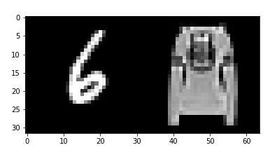
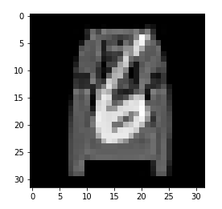
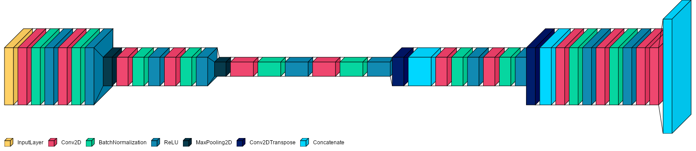
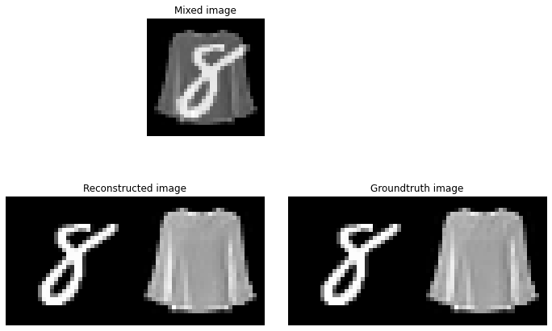

# Blind-Image-Separation
This project was developed for the [Deep Learning](https://www.unibo.it/en/teaching/course-unit-catalogue/course-unit/2022/446594) course of the [Master's Degree in Artificial Intelligence](https://corsi.unibo.it/2cycle/artificial-intelligence/index.html) at the University of Bologna.

## Problem statement
Blind source separation task requires separating different signals from a set of mixed ones, in our case we consider superimposed images taken from [MNIST](http://yann.lecun.com/exdb/mnist/) and [FASHION MNIST](https://www.kaggle.com/datasets/zalando-research/fashionmnist) datasets.   
An example of an original image (concatenated) and the mixed one that the model takes as input:
<p>


</p>

I implemented a simpler version of the [UNET](https://arxiv.org/abs/1505.04597) because the input images are small and in grayscale thus it's not necessary a model with a lot of layers in order to encode and decode the useful information for dividing the mixed images. In the following picture there is a representation of the implemented model, drawn with [visualkeras](https://github.com/paulgavrikov/visualkeras):
<p align="center">

</p>

After the training of the model I predicted some values in order to check the quality of the separation between the 2 images. In the image below you can see the input image, the image predicted by the model and the ground truth, the result is good but also a model with a worse MSE score is able to reach a quite good prediction therefore the main parameter considered to assess the quality of the model is the MSE score.
<p align="center">

</p>

My model reached an average MSE score of 0.0002999 tested on ten different test sets which contained 20 thousand samples each.

You can find a detailed explanation of my work in the `blind_image_separation.ipynb` file, that contains both the code implementation and the final report.

## Project structure

    .
	├── model               -> Source files for training, model and evaluation
    │   ├── BIS_model.py    -> Model implementation
	│   ├── data.py         -> Create the dataset to use for this task
	│   ├── train.py        -> Start/resume the training of the model, also from command line
    │   ├── utils.py        -> File with different functions to plot/check script's arguments
    │   └── evaluate.ipynb  -> Notebook to build, train/load pre-trained weights and evaluate the model
    │
	├── images	        -> Directory that contains images for the README and the plots 
    │
	├── weights     	-> Directory that contains my pre-trained weights and the weights saved by the checkpoint callback
	│
	├── blind_image_separation.ipynb 	-> Complete notebook that contains all the necessary code to create, train and test the model
	├── LICENSE
	├── README.md
    ├── environment.yml
	└── requirements.txt

## Getting started
- Clone this repository:
    ```bash
    git clone https://github.com/DanieleMorotti/Blind-Image-Separation.git
    ```

- Using a conda or any other virtual enviroment is suggested. Install the required packages using pip or conda running one of the following commands.    
    For `pip` users, type the command:
    ```bash
    pip install -r requirements.txt
    ```
    instead `conda` users can create an environment in the following way:
    ```bash
    conda env create -f environment.yml
    ```
### Notebooks and scripts usage
- The main notebook is `blind_image_separation.ipynb`, where you can find all the details of the implementation and the explanation of the entire project.    
I suggest you to run the notebook on [Google Colab](https://colab.research.google.com/?hl=en) in order to use a GPU because without it it's almost impossible to run the model successfully.

- The other notebook is `model/evaluate.ipynb` that you can use to test the model, training it from scratch or loading the pre-trained weights provided by me. In this notebook you can plot the history of the training (if you train from scratch), you can evaluate the MSE score changing different parameters for the tests and at the end you can see the visual separation of the images.

#### Training script
I wrote a simple script for launching the training of the model from the command line with the desired parameters.  
If you are inside the `model/` directory you can train the model from scratch passing different parameters, such as the learning rate, the metrics, the number of epochs, the steps per epoch, ... .
```bash
python train.py -train -lr 1e-3 --loss 'mse' --metrics 'mean_squared_error' --epochs 200
```

If you want to resume the training starting from some weights you can type:
```bash
python train.py -resume <weights_path> -lr 1e-3 --loss 'mse' --train-steps 6500 --validation-steps 500 --epochs 20
```

In both cases the weights of the model will be saved in `weights/cp_weights.h5` such that you are able to test the model loading the new weights.
You can see all the possible parameters of the script typing:
```bash
python train.py -h
```
